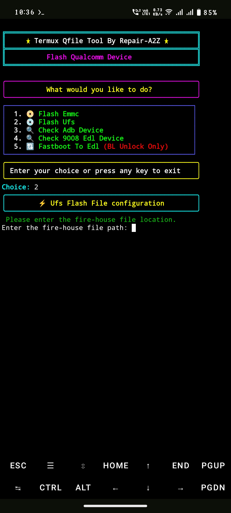

## Termux QDL-Flasher
Flash Qualcomm CPU Based Mobile Phones Using Termux ```Without PC```
(This Tool Run  in android ```arm,arm64,x86,x86_64``` architecture Termux Supported mobile) ```Root Required```


## installation :- 

```Install``` [termux](https://f-droid.org/repo/com.termux_1021.apk) & [termux api](https://f-droid.org/repo/com.termux.api_1000.apk) ```apk```
```console
pkg update && upgrade -y
```
```console
pkg install -y termux-api
```
```console
pkg install -y git
```
```console
pkg install -y libxml2
```
```console
pkg install -y sudo
```
```console
git clone https://github.com/Ishu43642/QDL-Flasher.git
```
```console
cd QDL-Flasher
```
```console
chmod -R +x .
```

# installation (only for fastboot option)Termux-Adb :-
[Termux-Adb Fastboot](https://github.com/nohajc/termux-adb) 

```credit :- Termux-Adb``` [nohajc](https://github.com/nohajc)

```console
bash installadb.sh
```

## Run Tool
```console
./qfile.sh
```


## Note :-
1. Download Your device firmware then extract it after extract Create ```qdl-flash``` folder in internal Storage.

2. Copy your all firmware file to ```qdl-flash``` folder.

```all firmware file Must be under qdl-flash folder```

```And qdl-flash folder under internal storage root```

after Run this tool useg Details show in screen.enter option according to your storage then paste your file location.


# Credit :-
1. nohajc - for [Termux-Adb Fastboot](https://github.com/nohajc/termux-adb)

2. [Mahesh Verma](https://github.com/MaheshTechnicals) - For Ui Enhancement in my tool

