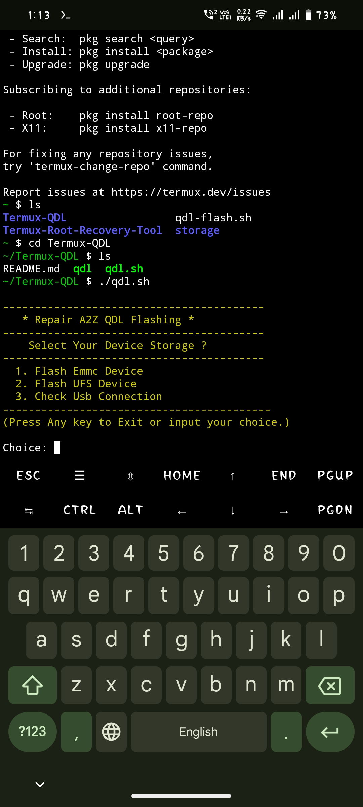

## Termux QDL-Flasher
Flash Qualcomm CPU Based Mobile Phones Using Termux ```Without PC```
(This Tool Run Only in ```arm64``` architecture Termux Supported mobile)

Tool Credit:- [Gautam Great](https://github.com/GautamGreat)

## installation :- 

```Install``` [termux](https://f-droid.org/repo/com.termux_118.apk) & [Termux-api](https://f-droid.org/repo/com.termux.api_51.apk) ```apk```
```console
yes | pkg update && upgrade
```
```console
pkg install termux-api
```
```console
pkg install git
```
```console
pkg install libxml2
```
```console
https://github.com/Ishu43642/QDL-Flasher.git
```
```console
cd QDL-Flasher
```
```console
chmod +x qdl && chmod +x qdl.sh
```

## Run Tool
```console
./qdl.sh
```


## Note :-
after Run this tool useg Details show in screen.enter option according to your storage then paste your file location.

